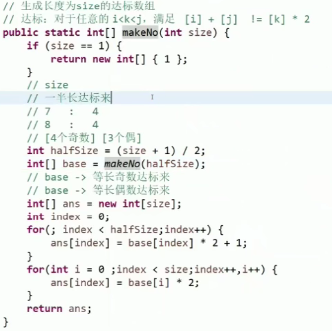

### 构造数组

> 输入一个 int 类型的值 $N$，构造一个长度为 $N$ 的数组 `arr` 并返回。
>
> 要求：对于任意的 `i<k<j`，都满足 `arr[i] + arr[j] != 2 * arr[k]`

其中一种思路：（有很多种解法）

构造一个序列 `{i, k, j}`，满足 `[i] + [j] ≠ 2 * [k]`

比如 `{2, 1, 3}`，对他进行 **“ 奇变换 ”** ，可以是 `{3, 1, 5}` 分表代表 `第 i 个奇数`

**“ 偶变换 ”** 同理为：`{2, 0, 4}`

将他们拼接到一起为 `{3, 1, 5, 2, 0, 4}` 同样满足条件

同理可以继续向上找长度为 12 的数组

 

> **Master 公式**，计算递归方式的复杂度：
>
> **$T(N) = a * T(N/b) + O(N^d)$**

参数：

- `a` 子过程调用次数
- `b` 子过程数据规模
- `d` 其他的时间复杂度

关系：

| 关系         | T(N)复杂度      |
| ------------ | --------------- |
| $logb^a < d$ | $O(N^d)$        |
| $logb^a > d$ | $O(N^{logb^a})$ |
| $logb^a = d$ | $O(N^d * logN)$ |

 

### 	bfprt 算法计算数组中第 K 大（小）的数

> **BFPRT** 算法，又称为中位数的中位数算法，由5位大牛（Blum 、 Floyd 、 Pratt 、 Rivest 、 Tarjan）提出，并以他们的名字命名。参考维基上的介绍Median of medians。
>
> 算法的思想是修改快速选择算法的主元选取方法，提高算法在最坏情况下的时间复杂度。 其主要步骤为： 
>
> 1. 首先把数组按5个数为一组进行分组，最后不足 5 个的忽略。对每组数进行排序（如插入排序）求取其中位数。 
>
> 1. 把上一步的所有中位数移到数组的前面，对这些中位数递归调用 BFPRT 算法求得他们的 中位数。
> 2.  将上一步得到的中位数作为划分的主元进行整个数组的划分。 判断第k个数在划分结果的左边、右边还是恰好是划分结果本身，前两者递归处理，后 者直接返回答案。

https://www.bilibili.com/video/av287849277

http://www.360doc.com/content/14/0905/10/11712807_407176425.shtml

### 刷题

1. **业务题**。注重分析能力，最优解就是在该题专有的业务上，找到聪明的做法。
2. **技巧题**。背后有一个数据结构、特殊算法，可以进行推广。

